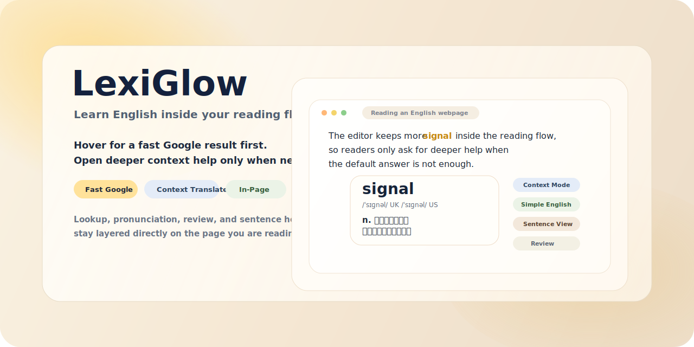
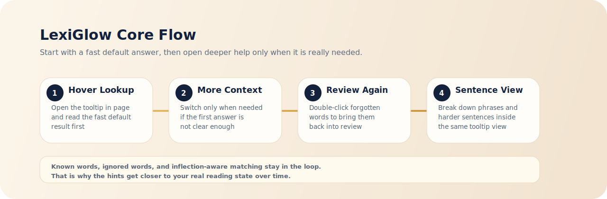

# LexiGlow | Learn English Inside Your Workflow

[简体中文说明](./README.zh-CN.md)



<p align="center">
  Start with a fast Google result, expand to contextual translation only when needed, and keep review, pronunciation, English explanations, and sentence analysis inside the page you are already reading.
</p>

<p align="center">
  <a href="https://github.com/xiaoyao888888/lexiglow/stargazers">
    
  </a>
  <a href="https://github.com/xiaoyao888888/lexiglow/blob/main/LICENSE">
    
  </a>
  <a href="https://github.com/xiaoyao888888/lexiglow/blob/main/COMMERCIAL.md">
    
  </a>
  
  
</p>

## What LexiGlow Is

LexiGlow is a Chrome extension for learning English while reading real pages on the web. Instead of pushing you into a separate flashcard flow, it overlays lookup, review, pronunciation, contextual translation, English explanations, and long-sentence analysis directly on top of your normal reading.

It is designed for reading situations like these:

- Hover an unfamiliar word and get a fast default translation first.
- Expand to contextual translation only when the default result is not precise enough.
- Double-click a word you used to know and bring it back into review.
- Read a simple English explanation adapted to your current vocabulary range.
- Break down a difficult sentence inside the same tooltip without leaving the page.

## Why It Is Built This Way

- Lightweight by default, deeper help on demand.
  Google handles the quick first pass, which is faster and cheaper. You only spend LLM calls when the context really matters.
- Reading flow stays uninterrupted.
  Hover lookup, selection translation, pronunciation, and sentence analysis all happen in place.
- Explanations adapt to your level.
  The English explanation mode takes your known-word range into account and tries to stay readable.
- Learner language support is built in.
  Translation output and extension UI can follow one of the built-in learner languages instead of staying fixed to Chinese.

## Core Features

- Hover lookup with a fast default translation
- On-demand contextual translation when the default answer is not enough
- Multiple LLM providers: OpenAI / compatible, Gemini, and Claude
- Double-click to bring forgotten words back into review
- Simple English explanations tuned to the learner's vocabulary level
- Selection translation for words, phrases, and full sentences
- UK / US pronunciation with IPA and click-to-play
- In-tooltip long-sentence analysis with clause blocks, structure hints, translation, and reasoning steps
- Persistent learning state for known words, review words, and ignored words
- Inflection-aware mastery: marking `add` as known also covers `adds / added / adding`, while derived forms like `addition / additive` stay separate
- Built-in learner-language support for:
  `zh-CN`, `zh-TW`, `ja`, `ko`, `fr`, `de`, `es`, `pt-BR`, `ru`, `it`, `tr`, `vi`, `id`, `th`, `ar`



## Install And Run

```bash
npm install
npm run fetch:lexicon
npm run build
```

Then load it in Chrome:

1. Open `chrome://extensions`
2. Enable `Developer mode`
3. Click `Load unpacked`
4. Select the repo root or `dist`

Recommended quick check:

1. Open an English webpage
2. Hover a highlighted word and confirm the tooltip appears
3. Double-click a word and confirm it re-enters review
4. Select a phrase or sentence and confirm the default translation appears first
5. Click `Context Translate` and confirm you get a more context-aware result, or a simple English explanation depending on your settings
6. Click `Sentence Analysis` and confirm the panel switches into analysis mode
7. Open the settings page and confirm you can switch learner language plus `OpenAI / Compatible`, `Gemini`, and `Claude`

Known-word state automatically merges common inflections including plural forms, third-person singular, past tense, past participle, and present participle. Derived forms are still handled independently, so knowing `work` also covers `works / worked / working`, but not automatically `worker` or `workable`.

## License And Commercial Use

LexiGlow currently uses a source-available license. It is not MIT and not a traditional permissive open-source license.

- Non-commercial learning, research, testing, and teaching use is allowed
- Commercial use requires prior written authorization from the author
- If you modify, port, adapt, or substantially rewrite this project, you must provide clear attribution to the original source

See:

- [LICENSE](./LICENSE)
- [COMMERCIAL.md](./COMMERCIAL.md)

If you want to use LexiGlow in a product, company workflow, paid service, enterprise deployment, or client delivery, contact the author first for a commercial license.
