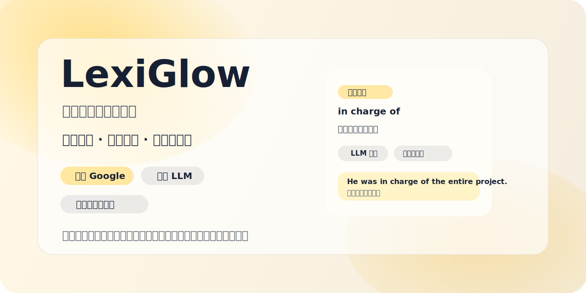

# LexiGlow | 在工作流里顺手学英语

[English README](./README.md)



<p align="center">
  默认用 Google 快速查词，只有在需要更高质量时才切到语境翻译；复习、英英解释和长难句分析都留在当前页面完成。
</p>

<p align="center">
  <a href="https://github.com/xiaoyao888888/lexiglow/stargazers">
    
  </a>
  <a href="https://github.com/xiaoyao888888/lexiglow/blob/main/LICENSE">
    
  </a>
  <a href="https://github.com/xiaoyao888888/lexiglow/blob/main/COMMERCIAL.md">
    
  </a>
  
  
</p>

## LexiGlow 是什么

LexiGlow 是一个 Chrome 英语阅读插件。它不是让你切出去背词，而是把查词、复习、发音、语境翻译、英英解释和长难句分析直接叠加到你平时的网页阅读里。

它更适合这类阅读场景：

- 悬停未掌握单词，先快速看默认翻译
- 默认结果不够准时，再切到语境翻译
- 遇到以前学过但又忘了的词，双击把它拉回复习
- 想用英文理解单词时，直接看一版符合自己词汇水平的解释
- 遇到复杂句子，直接在同一个 tooltip 里拆解理解

## 为什么这样设计

- 默认轻量，按需增强：
  先给 Google 结果，响应更快，也更省 token；只有在需要更高质量时再切到语境翻译
- 不打断阅读：
  悬停查词、选中文本翻译、发音、长难句分析都留在当前页面完成
- 解释会跟着你的水平变化：
  英英解释会参考你的已掌握词汇量，尽量用你看得懂的英语来解释新词
- 已支持学习语言切换：
  翻译内容和插件界面都可以跟随学习语言切换，不再固定只面向中文用户

## 核心能力

- 悬浮查词：
  默认显示 Google 翻译，适合高频阅读场景
- 语境翻译：
  当默认结果不够准时，再按需使用更高质量的上下文翻译
- 多 LLM 提供商：
  语境翻译支持在 OpenAI / Compatible、Gemini、Claude 之间切换
- 双击恢复提示：
  把学过但忘了的词重新拉回复习状态
- 英英解释：
  根据当前已掌握词汇量，动态生成更容易读懂的英文解释
- 选中文本即翻译：
  单词、词组、整句都能先看默认翻译
- 英美发音：
  支持英音 / 美音音标和点击播放
- 长难句拆解：
  在同一个 tooltip 内展示句块拆分、关键词提示、整句翻译和拆解过程
- 学习状态累积：
  已掌握词、复习词、忽略词会持续影响后续提示
- 常见词形归并：
  标记 `add` 为已掌握后，`adds / added / adding` 会一起按已掌握处理；`addition / additive` 这类派生词仍单独判断
- 已内置 15 种学习语言：
  `zh-CN`, `zh-TW`, `ja`, `ko`, `fr`, `de`, `es`, `pt-BR`, `ru`, `it`, `tr`, `vi`, `id`, `th`, `ar`


## 安装使用

```bash
npm install
npm run fetch:lexicon
npm run build
```

然后在 Chrome 中加载：

1. 打开 `chrome://extensions`
2. 开启 `Developer mode`
3. 点击 `Load unpacked`
4. 选择项目根目录或 `dist`

推荐先试这几步：

1. 打开一个英文网页
2. 悬停一个高亮单词，确认 tooltip 能出现
3. 双击一个词，确认它会重新进入复习
4. 选中一个词组或整句，确认会先出现默认翻译
5. 点击 `Context Translate`，确认可看到更贴合上下文的结果，或按配置显示英英解释
6. 点击 `Sentence Analysis`，确认会切到分析视图
7. 打开设置页，确认可以切换学习语言，以及 `OpenAI / Compatible`、`Gemini`、`Claude`

已掌握状态会自动归并常见屈折变化，包括复数、三单、过去式、过去分词和现在分词；派生词仍独立判断，因此掌握 `work` 会连带覆盖 `works / worked / working`，但不会自动覆盖 `worker` 或 `workable`。

## 许可证与商用

LexiGlow 当前采用源码可见许可，不是 MIT，也不是传统宽松开源许可。

- 允许非商业学习、研究、测试、教学使用
- 商业使用必须先获得作者书面授权
- 基于本项目的修改、移植、二次开发、换语言重写，只要实质上基于本项目，都必须显著标注来源

详细条款见：

- [LICENSE](./LICENSE)
- [COMMERCIAL.md](./COMMERCIAL.md)

如果你希望把本项目用于产品、公司项目、收费服务、企业部署或客户交付，请先联系作者获取商业授权。
